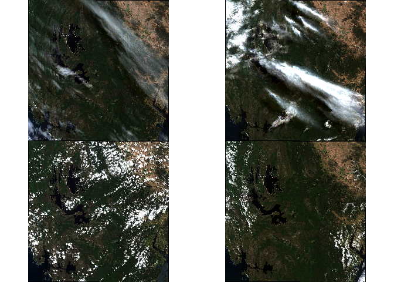

<!-- README.md is generated from README.Rmd. Please edit that file -->

# scene

<!-- badges: start -->
<!-- badges: end -->

The goal of scene is to …

## Installation

You can install the development version of scene like so:

``` r
# FILL THIS IN! HOW CAN PEOPLE INSTALL YOUR DEV PACKAGE?
```

## Example

Get imagery, this uses recent dates and a small extent around a longlat
(see `scene()`).

By default we get the “best” images from all available. Internally we
sort by “solar day” (scenes taken at the same time, but possibly spread
over tiles and/or zones). Atm “best” is defined by information content
(super rough, just we look at the least compressible scenes).

‘date’ is treated like a date range (if you get a stac error go further
back in time for the max.) You can input strings like “2024” or
“2024-02” for intervals, or a full range of date-times.

``` r
options(parallelly.fork.enable = TRUE, future.rng.onMisuse = "ignore")
library(furrr); plan(multicore)
#> Loading required package: future
x <- scene:::scene(date = Sys.Date() + c(-180, -2), keep = 4L)
#> processing %i (keep) of %i scenes from %i (solar) days45150
plan(sequential)


library(terra)
#> terra 1.7.65
par(mfrow = n2mfrow(nrow(x)))
jk <- lapply(x$dsn, \(.x) plotRGB(rast(.x)))
```



``` r
x$date
#> [1] "2024-02-13" "2024-02-28" "2023-12-25" "2024-01-09"
```

Other approaches use a “median” approach, this is just part of ongoing
experimentation for small areas.
